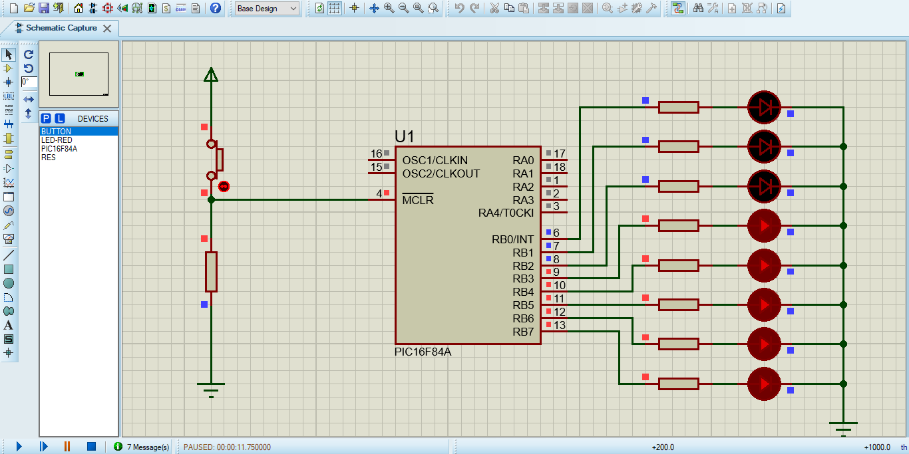

# Knight Rider LED Simulation 🏎️⚡

A hardware simulation project showcasing a sequential LED chaser layout (Knight Rider effect) designed, programmed, and tested using Proteus.

---

## 🔬 Technical Breakdown

Unlike a simple hardware-based chaser built with a 555 timer, this implementation relies on a fully programmable **PIC16F84A 8-bit microcontroller** to handle the sequential timing logic.

### 🔌 Hardware Configuration
- **Microcontroller:** PIC16F84A
- **Output Port:** `PORTB` (Pins RB0 through RB7) are configured as digital outputs to control the 8-element red LED array.
- **Current Regulation:** Individual current-limiting resistors are placed inline with each LED to ensure stable operation and protect the simulated components.
- **Master Clear (MCLR):** Pin 4 is tied to an external hardware reset switch configuration to safely control the execution state of the microcontroller.

### 💻 Firmware Logic & Control Flow
The sequential bouncing effect (Knight Rider pattern) is handled entirely in firmware:
1. **Directional Bit-Shifting:** The program utilizes bit-shifting operations (`<<` and `>>`) to seamlessly move a high state (`1`) across the `PORTB` register.
2. **Timing Control Loops:** Custom software delay routines are executed between bit-shifts to control the chasing speed of the LEDs smoothly.
3. **Boundary Condition Handling:** Edge-detection logic in the code catches when the active bit reaches `RB0` or `RB7`, immediately reversing the shifting direction to create the back-and-forth bounce.

---

## 📸 Circuit Schematic
Here is the simulation circuit layout:

## 🎥 Live Simulation
See the PIC16F84A bit-shifting execution sequence in real-time:

(https://github.com/user-attachments/assets/4f7a5fa0-203a-4328-8abb-f702c903a023)

---

## 🚀 How to Run the Simulation
1. Clone this repository or download the project files.
2. Open the [Knight Rider LED.pdsprj](./Knight%20Rider%20LED.pdsprj) project file using Proteus 8 Professional or higher.
3. Click the **Play / Run Simulation** button at the bottom left corner of Proteus to watch the LED chasing sequence action.
